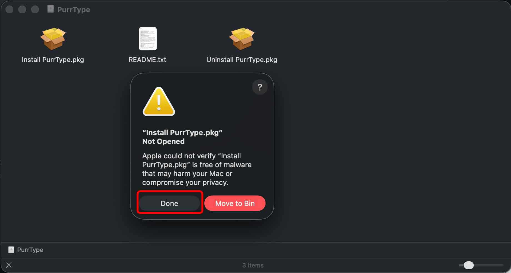
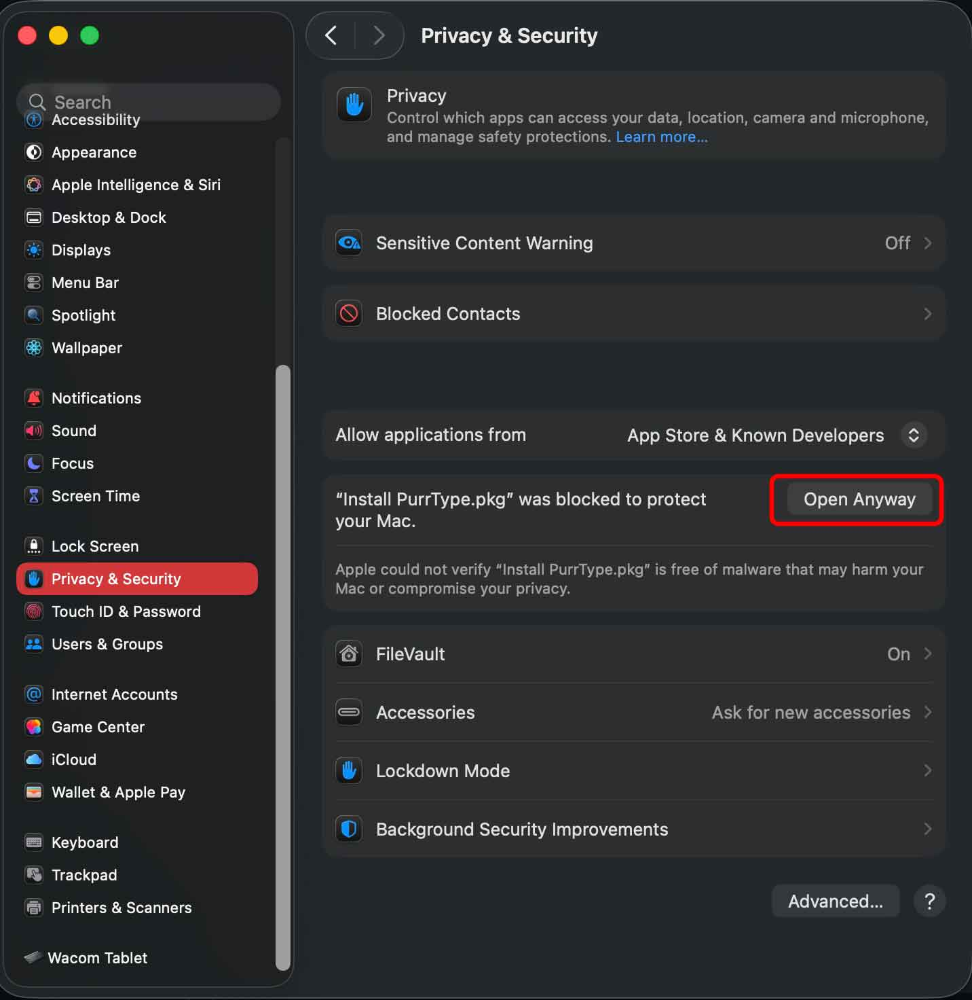
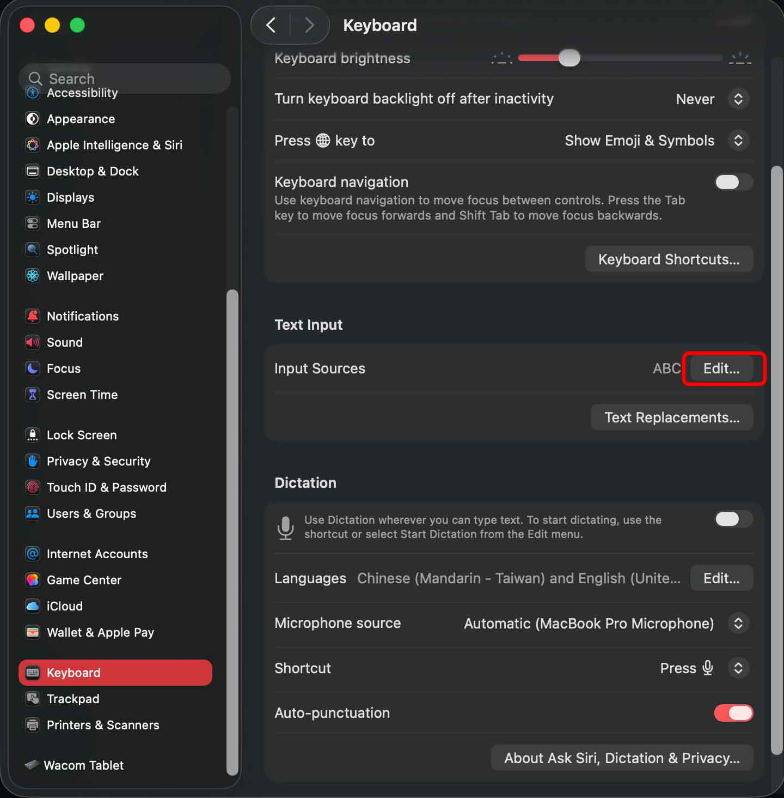
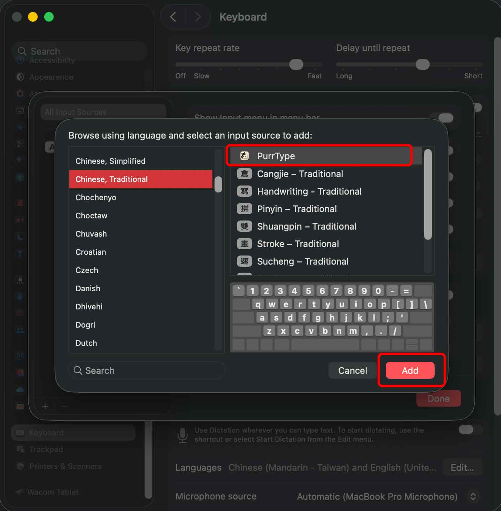
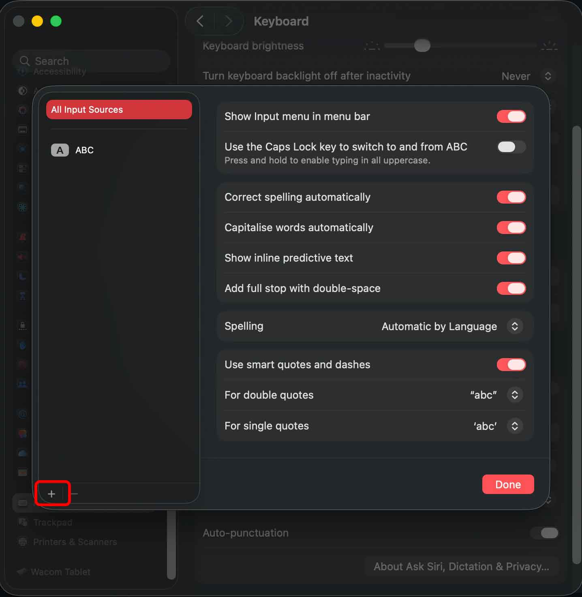

# PurrType Install Guide

Language: [繁體中文](#繁體中文) | [English](#english)

Official download:
[PurrType-0.1.4.dmg](https://github.com/355070xx/PurrType/releases/download/v0.1.4/PurrType-0.1.4.dmg)

Do not download GitHub's auto-generated `Source code` zip/tar.gz files to
install PurrType. Those files are source archives, not the installer.

## 繁體中文

### 1. 打開 DMG 並啟動安裝程式

下載 `PurrType-0.1.4.dmg`，然後用 Finder 打開。

在 DMG 入面 double-click `Install PurrType.pkg`。

目前 PurrType public build 尚未 signed / notarized，所以 macOS 可能會顯示
`"Install PurrType.pkg" Not Opened`。

如果見到這個 warning，請按 `Done`。

不要按 `Move to Bin`。

只在你確認 DMG 是由 PurrType 官方 GitHub release 下載時繼續安裝。

### 2. 在 Privacy & Security 按 Open Anyway

打開 `System Settings > Privacy & Security`，捲到 Security 位置，然後在
`Install PurrType.pkg` 旁邊按 `Open Anyway`。

macOS 可能會要求你輸入 Mac 密碼或使用 Touch ID。確認後，繼續完成 Installer
流程。

### 3. 打開 Keyboard 的 Text Input 設定

安裝完成後，如果 System Settings 已經開住，先 quit 再開返。

打開 `System Settings > Keyboard`，在 `Text Input` 位置按 `Edit...`。

### 4. 新增輸入來源

在 `All Input Sources` 視窗左下角按 `+`。

### 5. 加入 PurrType

選擇 `Chinese, Traditional`，再選 `PurrType`，然後按 `Add`。

回到 Input Sources 視窗後按 `Done`。

PurrType 之後會出現在 macOS input menu。

如果仍然見不到 `PurrType`，請 log out 再 log in，然後重新打開
`System Settings > Keyboard > Text Input > Edit...` 檢查。

### 移除 PurrType

重新打開同一個 DMG，double-click `Uninstall PurrType.pkg`。

Uninstaller 只會移除 PurrType app bundles 同 package receipts，會保留本機
PurrType preferences 同 New Sucheng learning data。

## English

### 1. Open The DMG And Start The Installer

Download `PurrType-0.1.4.dmg`, then open it in Finder.

Inside the DMG, double-click `Install PurrType.pkg`.

Current PurrType public builds are unsigned and not notarized, so macOS may show
a warning like `"Install PurrType.pkg" Not Opened`.

If this warning appears, click `Done`.

Do not click `Move to Bin`.

Only continue if you downloaded the DMG from the official PurrType GitHub
release link above.

### 2. Open Anyway

Open `System Settings > Privacy & Security`, scroll to the Security section,
then click `Open Anyway` for `Install PurrType.pkg`.

macOS may ask for your Mac password or Touch ID. Confirm it, then continue the
Installer flow.

### 3. Open Keyboard Text Input

After installation, quit and reopen System Settings if it was already open.

Open `System Settings > Keyboard`, then click `Edit...` in the `Text Input`
section.

### 4. Click Add Input Source

In `All Input Sources`, click the `+` button at the bottom-left.

### 5. Add PurrType

Select `Chinese, Traditional`, choose `PurrType`, then click `Add`.

Click `Done` when you return to the Input Sources window.

PurrType is now available from the macOS input menu.

If `PurrType` still does not appear, log out and log back in, then reopen
`System Settings > Keyboard > Text Input > Edit...` and check again.

### Remove PurrType

Open the same DMG and double-click `Uninstall PurrType.pkg`.

The uninstaller removes only PurrType app bundles and package receipts. It keeps
local PurrType preferences and New Sucheng learning data.
